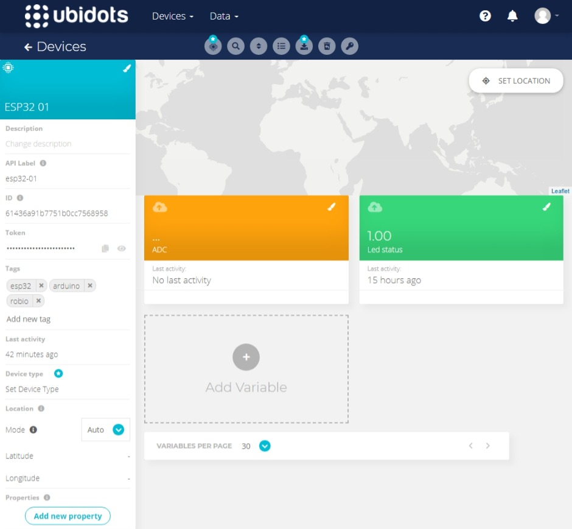
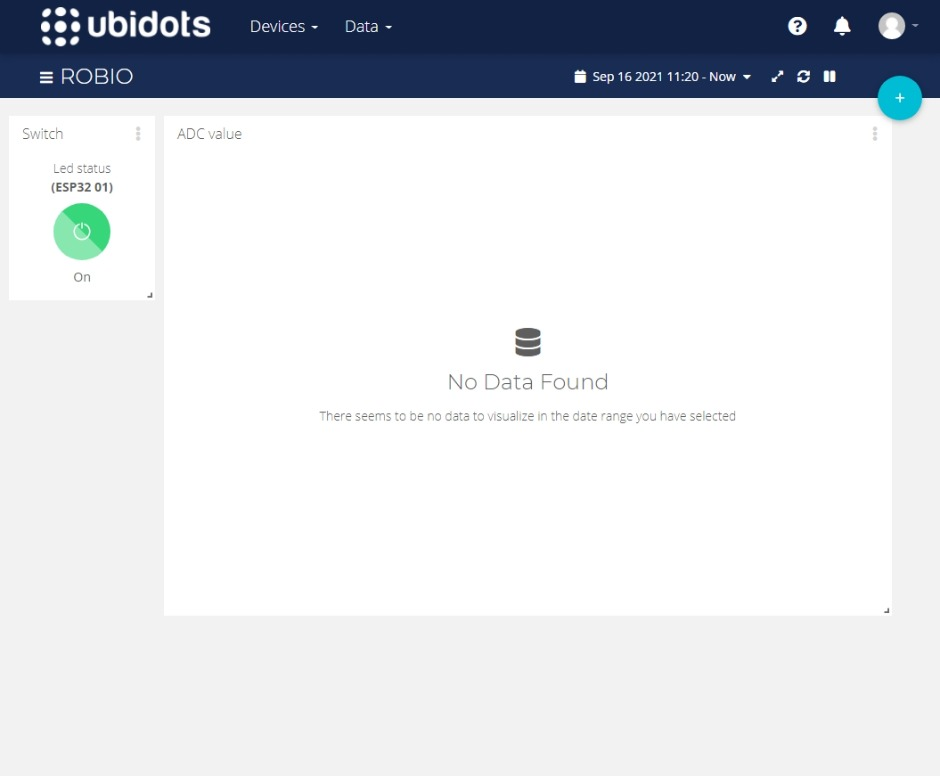
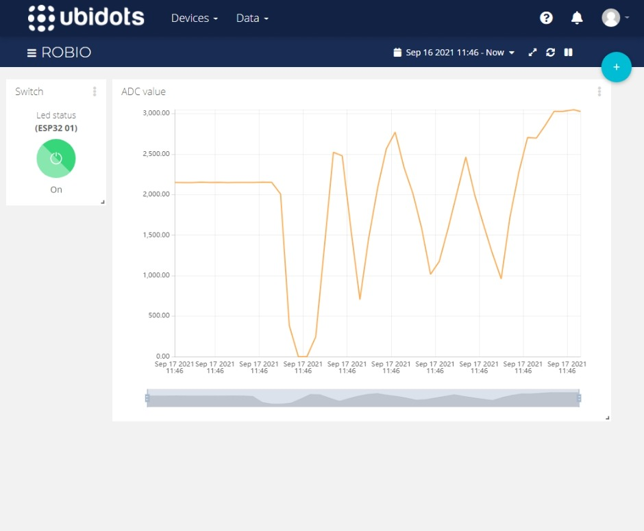

# Arduino + ESP32 + Wi-Fi + Ubidots

This an example of how to configure an ESP32 dev kit connecting to Wi-Fi, and subscribing and publishing data from/to topics with [Ubidots](https://ubidots.com/) using the [MQTT protocol](https://en.wikipedia.org/wiki/MQTT).

## Requeriments

### :computer: Software

- [Arduino IDE](https://www.arduino.cc/en/software) (recommended for beginners) or [VSCode](https://code.visualstudio.com/) with [Arduino VSCode Extension](https://marketplace.visualstudio.com/items?itemName=vsciot-vscode.vscode-arduino) (not covered in this README)

### :cd: Board drivers

- [Arduino-ESP32](https://raw.githubusercontent.com/espressif/arduino-esp32/gh-pages/package_esp32_index.json)

<!-- Installation instructions of ESP32 boards using the Board Manager [:link:](https://docs.espressif.com/projects/arduino-esp32/en/latest/installing.html) -->

### :books: Libraries:

- [UbidotsEsp32Mqtt](https://github.com/ubidots/esp32-mqtt)
- [PuSubClient](https://github.com/knolleary/pubsubclient)

<!-- Installation instructions of Arduino libraries [:link:](https://www.arduino.cc/en/guide/libraries) -->

## Getting started

### Preparing Ubidots

#### :satellite: Create a device

Before this, you need to create an account in [Ubidots](https://ubidots.com/). Once created, follow the next steps:

1. Go to your [dashboards page](https://stem.ubidots.com/app/dashboards/).
2. Click on `Devices > Devices`.
3. Hover the Add icon and click on `Add new Device`.
4. From all the device types listed, select `Blank Device`.
5. Indicate as a name and label 'ESP32 01' and 'esp32-01', respectively.

   > You can use another name and label, but then you have to edit the code example accordingly.

6. Now, click in the recently created device, and click on `Add Variable > Raw`. Name it 'Led status'.
7. Repeat step 6 with a variable named `ADC`.

   > By default, Ubidots labels your variables automatically, but if you didn't indicate any name during the creation of the variable, it will use a generic non-readable label. Ensure that the variable 'Led status' and 'ADC' have as labels 'led-status' and 'adc', respectively.

Your new device should look like this.



#### :chart_with_upwards_trend: Create a dashboard

We have created our device and its available variables. Let's create a dashboard to plot them.

1. Go to the dashboards page clicking on `Data > Dashboards`.
2. Create a new dashboard clicking on the <kbd>Add new Dashboard</kbd> button.
3. Indicate a name for the dashboard and create the dashboard.
4. Click on 'Add new Widget' and select 'Switch'. Name it 'Led status'.
5. In the data section, click 'Add Variables' and select `ESP32 01 > Led status`.
6. Once created, the widget will serve us to publish the led status to the cloud and the board will read the variable to control the on board led accordingly.
7. Create another widget of type 'Line chart' named 'ADC values' and with the variable `ESP32 01 > ADC`. The widgets can be moved and resized.

Once finished, you should have a dashboard like this (no data are shown as we have not sent something yet).



### Preparing Arduino

#### :heavy_plus_sign: Add board to Arduino IDE

First of all, we need to add our ESP32 board in Ardunio IDE in order to make it appear in the board manager. Follow these steps:

1. Open Arduino IDE (how to install is not covered here... it's just a `Next`, `Next`, `Next`, ..., procedure).
2. Go to `File > Preferences`.
3. In Additional Boards Manager URLs, add the URL

   ```URL
   https://raw.githubusercontent.com/espressif/arduino-esp32/gh-pages/package_esp32_index.json
   ```

   If you have other board URLs, add a comma at the end and then place the new URL.

4. Then, go to `Tools > Board > Boards Manager...` and, after an update, type `ESP32` in the search field. The esp32 board **by Espressif Systems** will be listed. Click <kbd>Install</kbd>.
5. Once finished, you have your available in Arduino IDE. To select it, go to `Tools > Board > ESP32 Arduino` and select `ESP Dev Module`.
6. Plug your board to the PC using a USB cable and then select the proper COM port in `Tools > Port`.

Now you can develop code for your board and upload it to the [MCU](## "microcontroller unit").

#### :exclamation: Upload code to the MCU

In order to upload code to your MCU, you must hold the <kbd>BOOT</kbd> in your board when the terminal outputs `Connecting...`. Once connected, you can release the <kbd>BOOT</kbd> button.

#### :file_folder: Adding libraries

To add the required libraries:

1. Download them from [here](https://github.com/ubidots/esp32-mqtt/archive/refs/heads/main.zip) and [here](https://github.com/knolleary/pubsubclient/archive/refs/heads/master.zip).
2. In Arduino IDE, go to `Sketch > Include Library > Add .ZIP Library...` and select the downloaded `.ZIP` files (one at a time).

Easy peasy.

#### :warning: Personal credentials

The code needs the Wi-Fi credentials and your Ubidots token to operate. These are sensitive data that must not be shared with anyone. For this reason, the file containing this information must not be committed.

The sensitive data must be added to a file called `private_data.h` in the root of the project. This file is in the `.gitignore` file and will not be committed.

A `private_data.template.h` file is provided with the variables to be initialized. Rename this file `private_data.h` and fill it with your personal data.

You can find the `UBIDOTS_TOKEN` in the web page of your device on Ubidots.

#### :runner: Running the code

Now just plug you board to the PC, verify and upload the code to the MCU (remeber the <kbd>BOOT</kbd> button). Check the output at the serial terminal and, once connected, control the on board led from the dashboard and view the data from the ADC.



You have implemented a node for an [IoT](## "Internet of Things") application! Congrats!! :tada:

Play with the code to subscribe to more topics, to publish more data or to change the publish frequency, or add more nodes/devices in the network.

# License

This code is released under the [MIT License](./LICENSE).
